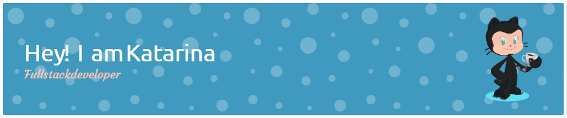

<h1 align="left">Hello World! I'm Katarina, a Canadian Web Developer 👋🏼:</h1>

###

🛜 Currently working on my own <a href="https://katarinamusladin.com" target="_blank">webpage</a> and <a href="https://github.com/katarinamusladin/Quill" target="_blank">Quill Journal App</a> 
👨🏼‍🎓 Computer Engineer and BrainStation Software Engineering Alumni  
👨🏼‍💻 Currently working on my own projects and expanding my web development skills

###

<h2>💻 Tech Stack: </h2>
###

  
  
  
  
  
  
  
  
  
  
  
  
  
  
  
  
  
  
  
  
  
  
  
  
  
  
  
  
  
  
  
  
  
  
  

###

  
  

###

 

###
